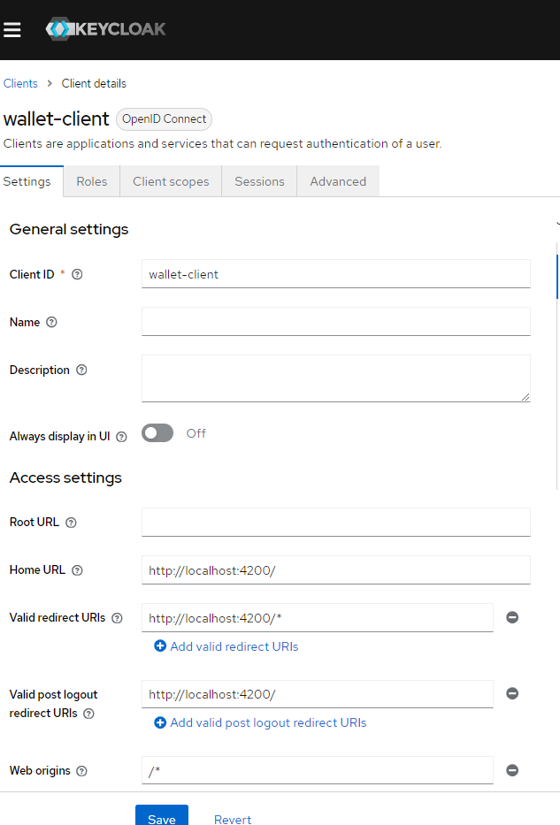
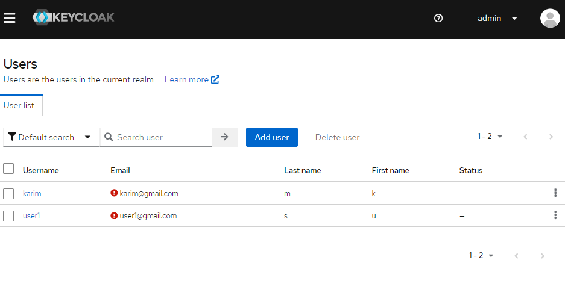
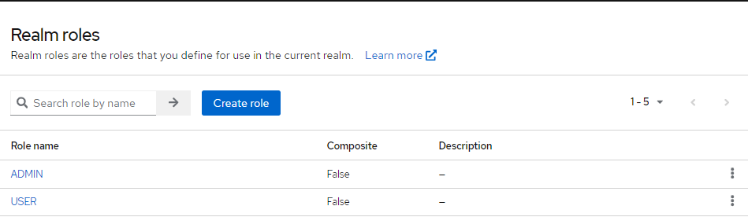
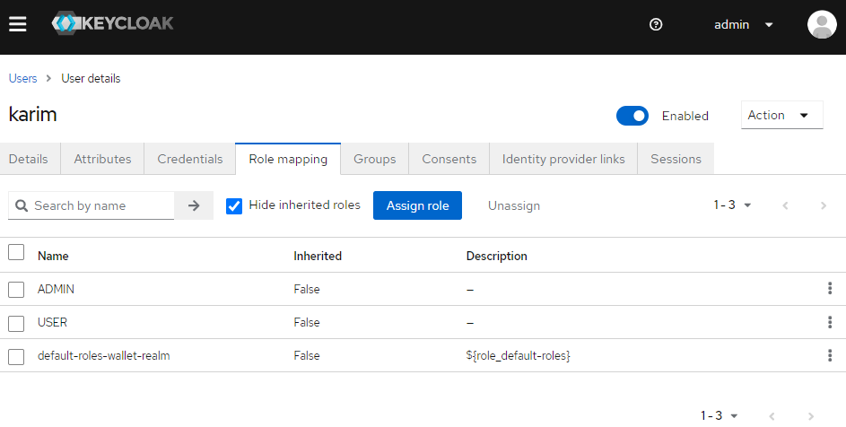
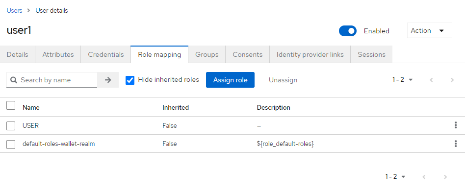
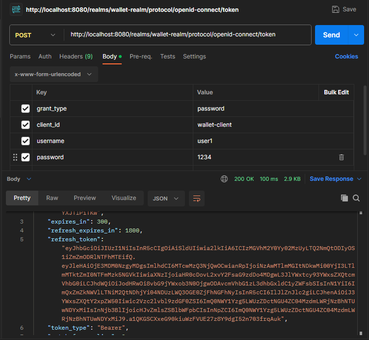

Configuration et test Keycloak 

Créeation d'un compte Admin

Création Ralm
Créaction d'un client wallet 

Création de deux utilisateurs :

Création de deux nouveaux rôles USER et ADMIN :

Affecter le rôle ADMIN et USER à l'utilisateur Karim :

Affecter le rôle USER à l'utilisateur user1 :

Test d'authentification avec user1

